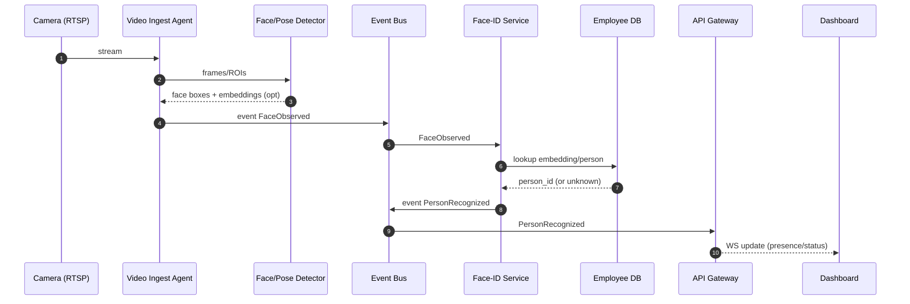

# Архитектура «умного мониторинга сотрудников» (AI Productivity Hub)

Цель: собрать события из видео/сенсоров, нормализовать их в поток событий, хранить метрики и показывать их в real-time дашборде, при этом соблюдая приватность, безопасность и управляемость.

## 1) Уровни системы (Edge → Stream → Core → Apps)

### Edge (на месте установки)
- **Video Ingest Agent**: RTSP/USB захват (GStreamer/OpenCV), извлечение кадров/ROI, трекинг.
- **On-Edge Inference (опционально)**: детекция лиц/позы/эмоций на edge-узле (GPU) → в центр уходят **события**, а не сырой поток.
- **Privacy filters**: маскирование фона/пикселизация лиц для режимов без идентификации.

### Stream (шина событий)
- Event bus: Kafka/RabbitMQ.
- Формат событий: JSON/Protobuf, единый event envelope.

### Core (backend-сервисы)
- **Identity**: сопоставление эмбеддингов с сотрудниками, управление профилями.
- **Behavior**: события позы/внимания/эмоций (если разрешено политикой).
- **Indoor positioning**: Wi‑Fi/BLE → зоны/траектории.
- **Scoring**: расчёт KPI/продуктивности (правила + ML).
- **API Gateway**: FastAPI REST + WebSocket для real-time.

### Apps
- **Dashboard** (React): присутствие, карта зон, графики, алерты.
- (Опционально) Mobile: уведомления и рекомендации.

## 2) Диаграмма контекста (C4-ish)

```mermaid
flowchart TB
  subgraph Edge[Edge / Office]
    CAM[IP/USB Cameras]
    AP[Wi‑Fi AP / BLE Beacons]
    VA[Video Ingest Agent]
    PF[Privacy Filter]
    CAM --> VA --> PF
    AP --> IPS[Indoor Sensor Collector]
  end

  subgraph Stream[Event Stream]
    BUS[(Kafka/RabbitMQ)]
  end

  subgraph Core[Backend / Core]
    ID[Face-ID Service]
    BEH[Behavior Analytics]
    POS[Indoor Positioning]
    SCR[Productivity Scoring]
    API[API Gateway (FastAPI)
REST + WebSocket]

    PG[(PostgreSQL / MariaDB)]
    TS[(TimescaleDB / InfluxDB)]
    R[(Redis)]

    ID <--> PG
    POS <--> PG
    SCR <--> TS
    API <--> R
    API <--> PG
    API <--> TS

    BUS --> ID
    BUS --> BEH
    BUS --> POS
    BUS --> SCR

    ID --> BUS
    BEH --> BUS
    POS --> BUS
    SCR --> BUS
  end

  subgraph Apps[Clients]
    WEB[Dashboard (React)]
    MOB[Mobile (optional)]
  end

  PF --> BUS
  IPS --> BUS
  API --> WEB
  API --> MOB
```

## 3) Ключевые потоки данных

### 3.1 Видео → присутствие (идентификация)


### 3.2 Wi‑Fi/BLE → зоны
- Сенсорный коллектор агрегирует RSSI/RTT/Beacon sightings.
- Сервис позиционирования превращает это в **зону** (area_id) и confidence.

### 3.3 Поведение → метрики
- Pose → posture_state (сидит/стоит/наклон головы/частота движений).
- Inattention → attention_state (ок/idle/distracted) — важно **не делать выводы выше точности модели**.
- Emotion (если включено политикой) → emotion_distribution, без хранения кадров.

## 4) Схема событий (единый envelope)
Рекомендуемый контракт (пример):

- `event_id`, `event_type`, `ts`, `source_id`, `tenant_id`
- `subject`: `{ person_id? | anonymous_track_id }`
- `payload`: специфично для события
- `privacy`: `{ level: anonymous|pseudonymous|identified, retention_class }`

Примеры событий:
- `face.observed`, `person.recognized`, `person.presence.updated`
- `behavior.pose.updated`, `behavior.attention.updated`
- `indoor.zone.entered`, `indoor.zone.exited`
- `kpi.score.updated`

## 5) Хранилища
- PostgreSQL: сотрудники, роли, справочники зон, устройства, политики.
- Timescale/Influx: метрики по времени (присутствие, активность, KPI).
- Redis: текущее состояние (онлайн-присутствие, last_seen), pub/sub для WS.

## 6) Безопасность и приватность (минимальный стандарт)
- Transport: TLS везде (камера→edge, edge→core, client→api).
- Access: RBAC/ABAC, отдельные роли для HR/Managers/Security/Employees.
- Audit: журнал всех запросов к персональным данным.
- Retention: разные сроки хранения (сырые события кратко, агрегаты дольше).
- Data minimization:
  - по умолчанию хранить **события и агрегаты**, не видео;
  - эмбеддинги и биометрию — отдельно, шифрование на уровне поля/таблицы.

## 7) Развёртывание (варианты)
- Small office: один edge-node + один core-server.
- Scale: много edge, core в Kubernetes, inference на GPU нодах.

## 8) Вопросы для фиксации MVP (ответь любыми пунктами)
1) Идентификация обязательна или можно начать с anonymous трекинга?
2) Нужна ли эмо-аналитика в MVP (часто блокируется политикой)?
3) Real-time задержка цель: 0.5–1с или допустимо 3–5с?
4) Сколько камер и сотрудников в пилоте?
